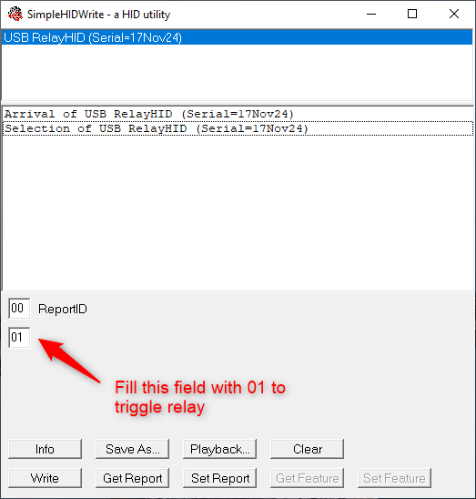
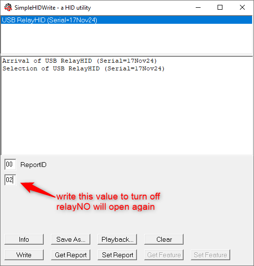

## 🚀 Features

This project aim to create a circuit board, which can help you control an ouptut via a relay.
- **Relay output with isolator**: Relay is controlled via an opto and the power also isolated.
- **HID interface**: no need to install any driver to make it works.
- **Python control**: you can use HID lib to control the board.
- **Simple HID program**: Attached a simple HID program to help you test connection.

## 📝 How to Use
- **How to build**: you need to install [sdcc compiler](https://sourceforge.net/projects/sdcc/files/) and <a href="https://gnuwin32.sourceforge.net/packages/make.htm" target="_blank">Makefile</a>.
- The relay is controlled via **ENDPOINT1**
  + With the first byte of data, ENDPOINT1[0] = 0x01 => Relay will be closed
    
  + With the first byte of data, ENDPOINT1[0] = 0x01 => Relay will be openned again
    
 
## 💻 MCU Used
- CH551G: datasheet [Eng ver](https://akizukidenshi.com/goodsaffix/CH552.pdf)
- Programmer: CH551G doesn't need a programmer hardware, you can download program via USB interface. It only needs a [Download Tool](https://www.wch-ic.com/downloads/WCHISPTool_Setup_exe.html) to flash the software.

## 📄 Files
- **Hardware_lite**: contains the PCB design in non-Isolator
- **Hardware_with_relay_isolation**: contains the PCB design with Isolator
- **SimpleHIDWrite3**: an simple HID program to write directly and data to endpoint
- **Makefile**: run this makefile via **"make all** to rebuild entirely project

## 📄 License

This project is licensed under the [MIT License](LICENSE).
